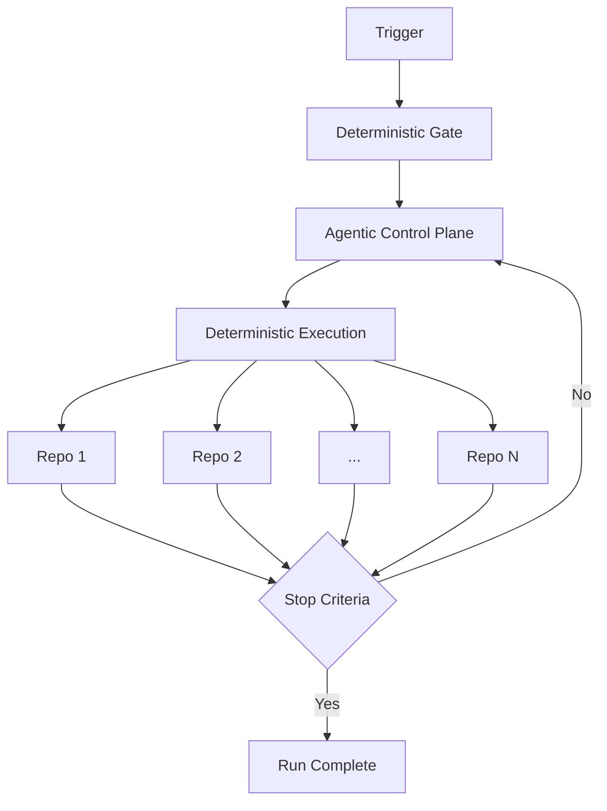

CentralRepoOps is a [MultiRepoOps](/gh-aw/patterns/multirepoops/) deployment variant where a single private repository acts as a control plane for large-scale operations across many repositories.

Use this pattern when you need to coordinate rollouts, policy updates, and tracking across tens or hundreds of repositories from one place.

## Authoring Profiles

Use profile-based authoring to pick your starting complexity:

- **Lean profile** for instruction-first rollout workflows with explicit tunable controls in one file.
- **Advanced profile** when you need campaign and wave-promotion controls.

## Examples

CentralRepoOps follows the standard single-source model: one `.md` source file plus `.lock.yml` after compile, with deterministic rollout mechanics delegated to a reusable gate workflow.

### Simple rollout example

Use this when you want one focused change in one repository per run.

```aw wrap
---
on:
  workflow_dispatch:
    inputs:
      target_repo:
        required: true
      objective:
        required: true

engine:
  id: copilot
  steps:
    - name: Checkout target repository
      uses: actions/checkout@v5
      with:
        repository: ${{ inputs.target_repo }}
        token: ${{ secrets.REPO_TOKEN }}

permissions:
  contents: read

tools:
  github:
    mode: remote
    toolsets: [repos, issues, pull_requests]

safe-outputs:
  create-issue:
    max: 2
  create-pull-request:
    max: 1
---

# Simple CentralRepoOps Rollout

Objective: {{inputs.objective}}

Target repository: {{inputs.target_repo}}

Make the smallest safe change needed to satisfy the objective.
If unsafe or blocked, create a tracking issue with clear next steps.
```

### Complex rollout example

Use this when enterprise admins should set policy, controls, and caps while deterministic shard/build mechanics stay hidden.

```aw wrap
---
on:
  workflow_dispatch:
    inputs:
      objective:
        required: true
      rollout_profile:
        required: false
      max_prs:
        required: false
      max_issues:
        required: false
      promote_to_next_wave:
        required: false
      next_rollout_profile:
        required: false
  manual-approval: production

concurrency:
  group: "centralrepoops-${{ github.workflow }}-${{ inputs.rollout_profile || 'standard' }}"
  cancel-in-progress: false

rate-limit:
  max: 2
  window: 60

tracker-id: centralrepoops-rollout

jobs:
  deterministic_gate:
    uses: ./.github/workflows/reusable-central-deterministic-gate.yml
    secrets: inherit
    with:
      rollout_profile: ${{ inputs.rollout_profile || 'standard' }}

engine:
  id: copilot
  needs:
    - deterministic_gate
  steps:
    - name: Checkout primary target repository
      uses: actions/checkout@v5
      with:
        repository: ${{ needs.deterministic_gate.outputs.primary_target_repo }}
        ref: ${{ needs.deterministic_gate.outputs.target_ref }}
        token: ${{ secrets.REPO_TOKEN }}
        path: target

permissions:
  contents: read

tools:
  github:
    mode: remote
    toolsets: [repos, issues, pull_requests, actions]

safe-outputs:
  dispatch-workflow:
    workflows:
      - my-workflow
    max: 1
  create-issue:
    max: ${{ inputs.max_issues || '20' }}
  create-pull-request:
    max: ${{ inputs.max_prs || '5' }}

---

# Complex CentralRepoOps Rollout (Admin-Facing)

Objective: {{inputs.objective}}

Profile: {{inputs.rollout_profile}}

Primary target: ${{ needs.deterministic_gate.outputs.primary_target_repo }} @ ${{ needs.deterministic_gate.outputs.target_ref }}

Deterministic gate status: ${{ needs.deterministic_gate.result }}

Execute the objective for deterministic gate-selected targets.

Prefer one focused PR per repository after deterministic checks pass.

If blocked, create tracking issues with explicit remediation steps.
```

Keep tunable defaults explicit in the main workflow so operators can edit knobs in one place.

Use implicit defaults when omitted:

- `rollout_profile=standard`
- `max_prs=5`
- `max_issues=20`
- `promote_to_next_wave=false`
- `next_rollout_profile=""`

Recommended defaults for initial rollout safety:

- `rate-limit.max: 2` and `rate-limit.window: 60` reduce rapid repeat invocations while still allowing retries.
- `concurrency.cancel-in-progress: false` preserves run auditability by finishing already-started executions.
- `tracker-id: centralrepoops-rollout` creates a stable marker for filtering and reporting rollout artifacts.

The reusable workflow (`reusable-central-deterministic-gate.yml`) contains the hidden mechanics:

> [!IMPORTANT]
> The reusable gate workflow is shipped by default. For advanced rollouts, pass optional policy inputs to the reusable gate call (targets, ref, shard settings).

- target resolution and validation
- shard selection math
- matrix checkout/build for each selected repository
- outputs such as `primary_target_repo` and `target_ref`

Admin-facing inputs stay intentionally small:

- `objective`
- `rollout_profile`
- `max_prs`
- `max_issues`

Optional steering inputs for wave promotion:

- `promote_to_next_wave`
- `next_rollout_profile`

Campaign control inputs (connect campaign policy to orchestration):

- `campaign_id`
- `campaign_goal`

`campaign_*` inputs are optional. Use them for multi-wave programs with KPI tracking; for one-off rollouts, leave them empty and run the same architecture without campaign semantics.

Built-in rollout guardrails stay in frontmatter (not admin inputs):

- `on.manual-approval`
- `concurrency`
- `rate-limit`
- `tracker-id`

Everything else (target discovery, sharding, build verification, policy allowlists, refs) remains inside the reusable gate.

Optional reusable-gate inputs for advanced rollout policy:

- `targets_pilot_json`
- `targets_standard_json`
- `targets_broad_json`
- `target_ref`
- `shard_count`
- `shard_index`

Example values:

- `targets_standard_json: '["my-org/service-a","my-org/service-b","partner-org/service-c"]'`
- `target_ref: main`
- `shard_count: '4'`
- `shard_index: '0'`

Example reusable workflow interface:

```yaml wrap
on:
  workflow_call:
    inputs:
      rollout_profile: { type: string, required: false }
    outputs:
      primary_target_repo:
        value: ${{ jobs.select_shard.outputs.primary_target_repo }}
      target_ref:
        value: ${{ jobs.resolve_policy.outputs.target_ref }}

jobs:
  # resolve_policy, select_shard, deterministic_build (hidden implementation)
```

## When to Use CentralRepoOps

- **Rollout operations** - Apply standard updates (e.g., Dependabot config, CI policy, labels) across many repos
- **Central governance** - Enforce organization-wide automation with explicit controls
- **Phased adoption** - Roll out by shard or tier (pilot → broader rollout)
- **Operational reliability** - Retry and replay failures without rerunning successful repos

## Architecture



## Canonical Pattern (Slim + Flexible)

Treat this as the default architecture for CentralRepoOps:

1. **Slim control workflow** (policy + intent only)
   - Keep only admin-facing inputs (`objective`, `rollout_profile`, caps)
   - Call the reusable deterministic gate
   - Run the agentic step against gate outputs
2. **Reusable deterministic gate** (all mechanics)
   - Target resolution
   - Shard selection
   - Deterministic checkout/build validation
   - Stable outputs contract
3. **Optional add-on workflows** (only when needed)
   - Replay failed shards
   - Promotion waves (`pilot` → `standard` → `broad`)
   - Reporting/aggregation

This keeps the default path simple while still letting you cover advanced campaign scenarios by composition.

## Optional Add-ons (Shipped)

These reusable workflows are available for scale operations when you need them:

- `.github/workflows/reusable-central-replay-failed-shards.yml`
- `.github/workflows/reusable-central-rollout-summary.yml`

### Replay failed shards

Use replay after a broad run to retry only failed targets:

```yaml wrap
jobs:
  replay_failed:
    uses: ./.github/workflows/reusable-central-replay-failed-shards.yml
    secrets: inherit
    with:
      failed_repos_json: ${{ needs.collect_failures.outputs.failed_repos_json }}
      target_ref: ${{ needs.deterministic_gate.outputs.target_ref }}
      max_replays: "10"
```

### Promotion waves

For phased rollout (`pilot` → `standard` → `broad`), run the same control workflow three times with different `rollout_profile` values.
Use `safe-outputs.dispatch-workflow` to trigger the next wave only after success and review.

Example dispatch payload for promoting the next wave:

```json wrap
{
  "type": "dispatch_workflow",
  "workflow_name": "central-repo-ops",
  "inputs": {
    "objective": "{{inputs.objective}}",
    "rollout_profile": "{{inputs.next_rollout_profile}}",
    "max_prs": "{{inputs.max_prs}}",
    "max_issues": "{{inputs.max_issues}}",
    "campaign_id": "{{inputs.campaign_id}}",
    "campaign_goal": "{{inputs.campaign_goal}}",
    "promote_to_next_wave": "false",
    "next_rollout_profile": ""
  }
}
```

### Rollout summary reporting

Use a summary job at the end of each run:

```yaml wrap
jobs:
  rollout_summary:
    uses: ./.github/workflows/reusable-central-rollout-summary.yml
    with:
      objective: ${{ inputs.objective }}
      rollout_profile: ${{ inputs.rollout_profile }}
      replay_targets_json: ${{ needs.replay_failed.outputs.replay_targets_json }}
      created_prs: "${{ inputs.max_prs }}"
      created_issues: "${{ inputs.max_issues }}"
```

`selected_targets_json` is optional in the summary workflow. Include it only if your custom deterministic layer publishes that list.

## Recommended Execution Model

Use a hybrid model:

1. **Agentic control-plane decisions** for steering (next wave, retry scope, mutation intent)
2. **Deterministic workflow backbone** for execution guarantees (fan-out, shard/build validation, approvals, auditable state transitions)

This keeps large-scale rollout operations reliable while still enabling AI-assisted orchestration.

## Security & Control Defaults

- Prefer GitHub App auth over long-lived PATs
- Use explicit `allowed-repos` for cross-repo writes
- Keep conservative `max` limits in safe outputs
- Use phased rollout (`5 → 25 → 100+ repos`) before org-wide execution

## Example Use Cases

- Roll out `.github/dependabot.yml` to all repos in a shard
- Create tracking issues for stale CI failures across multiple repos
- Apply standardized labels and branch policy helper PRs across teams

## Related Patterns

- [MultiRepoOps](/gh-aw/patterns/multirepoops/) - Cross-repository operations concept
- [SideRepoOps](/gh-aw/patterns/siderepoops/) - Separate automation repo pattern
